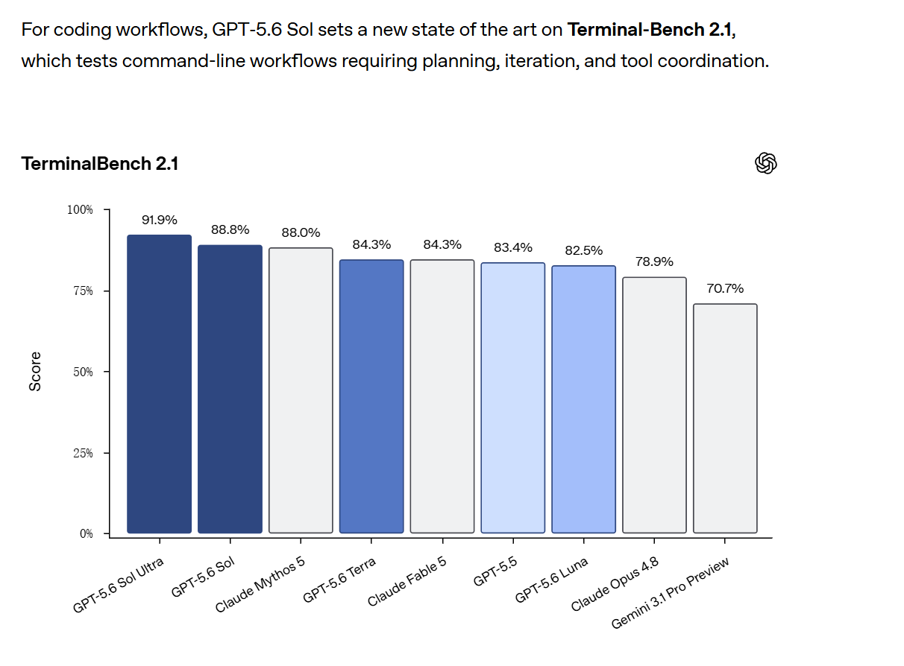
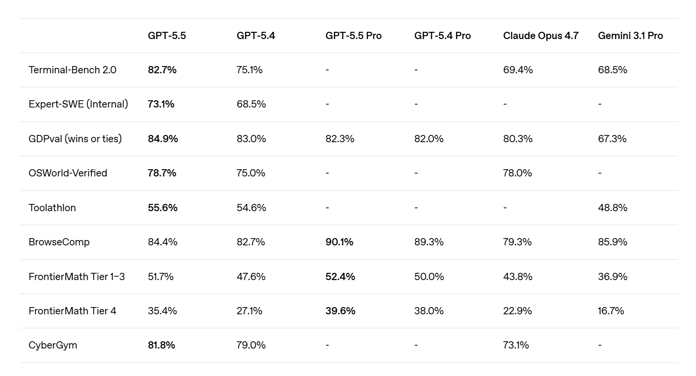
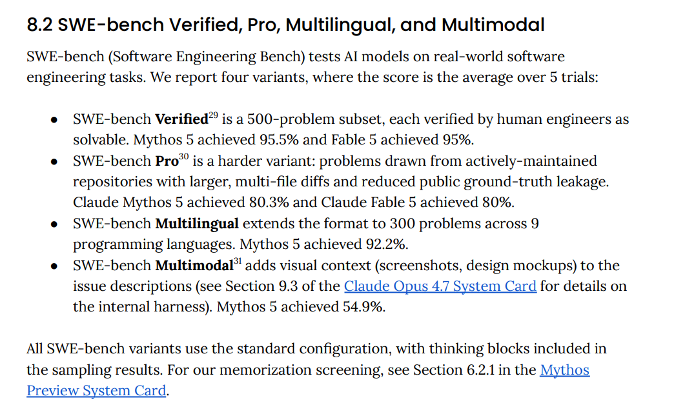
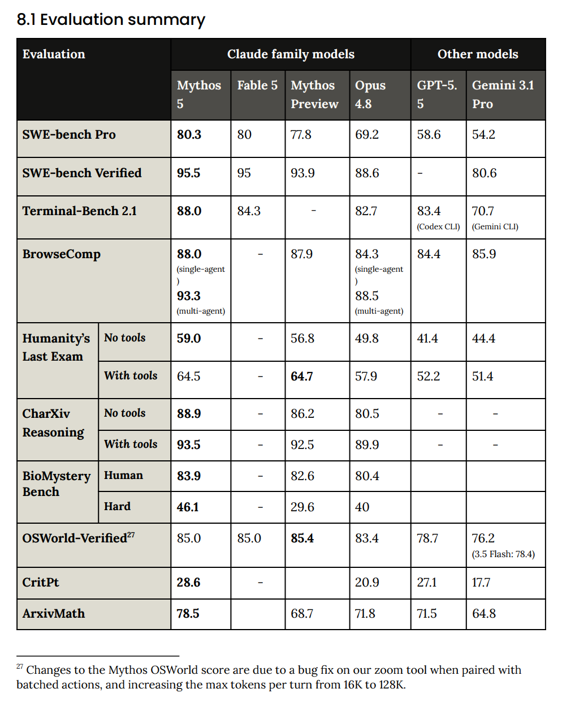
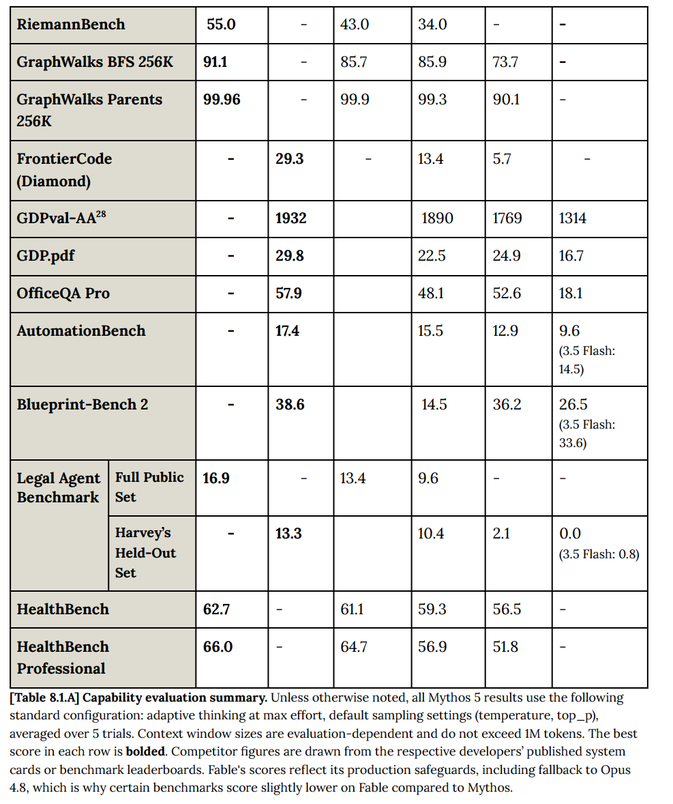
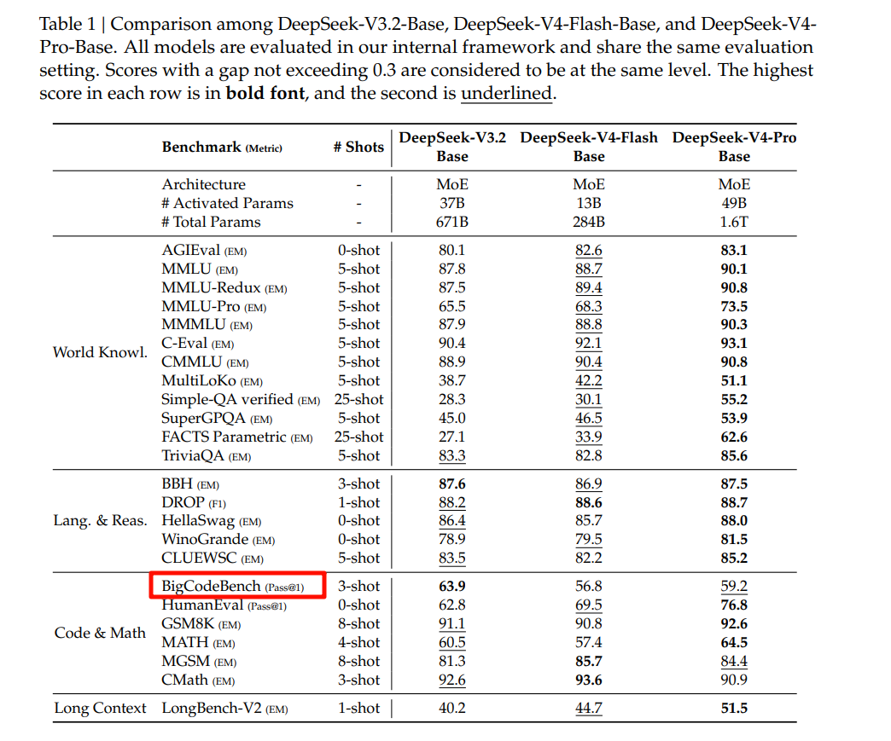
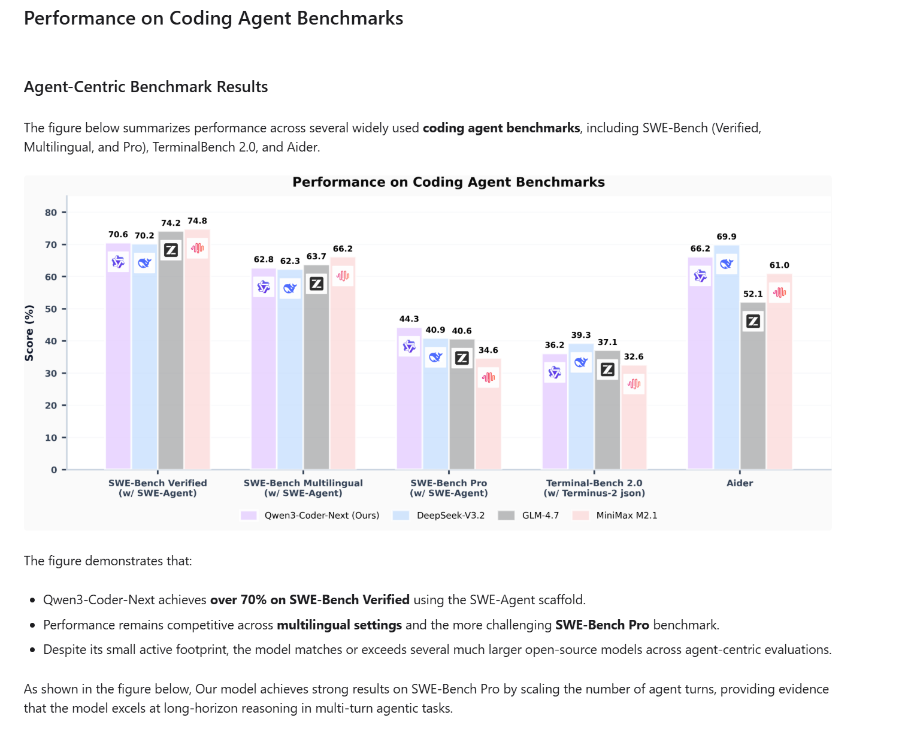
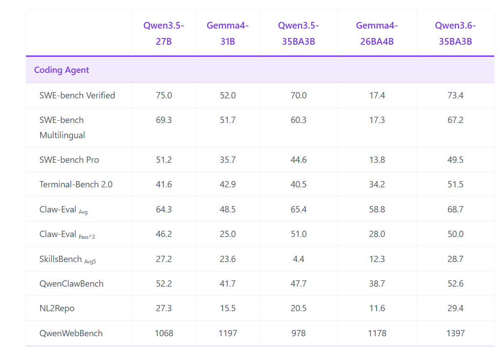
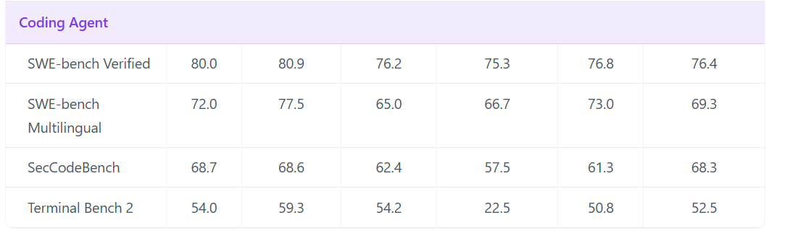
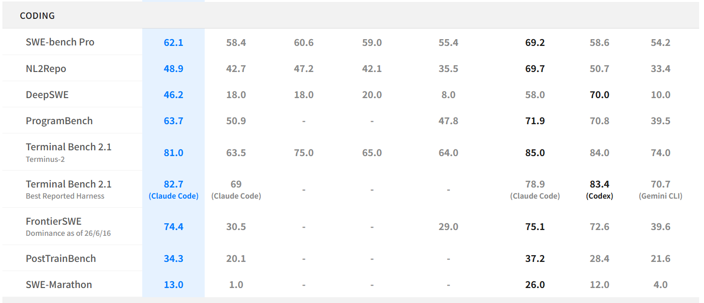

# Openai
## GPT5.6
https://openai.com/index/previewing-gpt-5-6-sol/

TerminalBench 2.1

## GPT5.5
https://openai.com/index/introducing-gpt-5-5/

# Claude code
https://www-cdn.anthropic.com/2f9323abbcc4abe219577539efe19a623c9ca2bd/Claude%20Fable%205%20&%20Claude%20Mythos%205%20System%20Card.pdf

# Google

# DeepseekV4
https://huggingface.co/deepseek-ai/DeepSeek-V4-Pro-DSpark

https://arxiv.org/pdf/2606.19348

# Qwen 
##  Qwen3-coder-next
https://qwen.ai/blog?id=qwen3-coder-next

Qwen3.6
https://huggingface.co/Qwen/Qwen3.6-35B-A3B

## Qwn3.5 
https://huggingface.co/Qwen/Qwen3.5-397B-A17B

# Z.AI
https://z.ai/blog/glm-5.2

# mamba3
https://arxiv.org/pdf/2603.15569